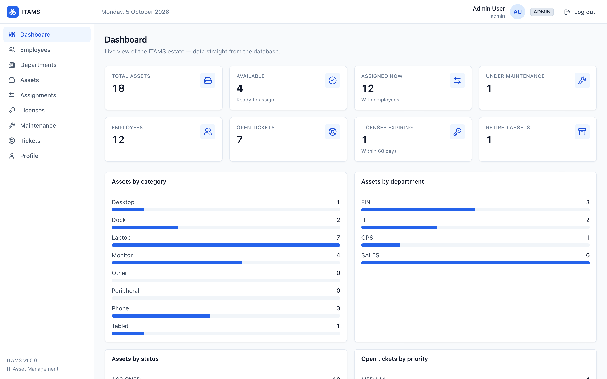
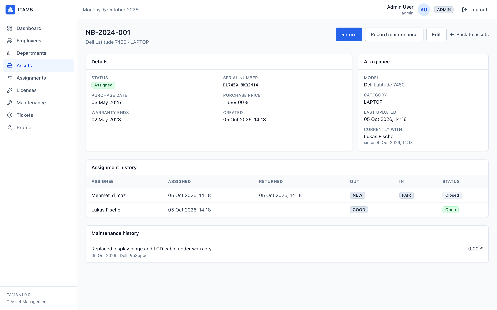
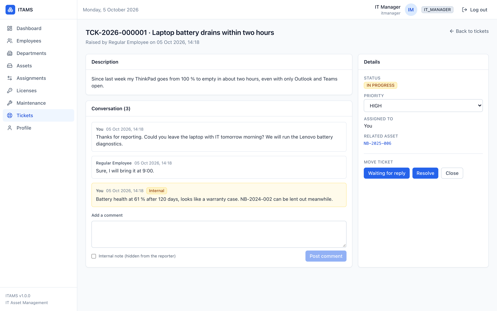
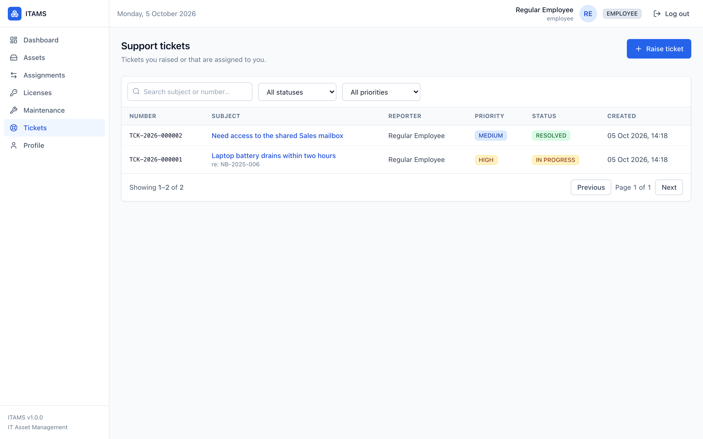

# ITAMS: IT Asset Management System

A web application for an IT operations team to manage the full lifecycle of company IT assets: purchase, stock, assignment to employees, maintenance and retirement. It also covers the software licences attached to people and devices, and the support tickets raised against them.

I built it to practise the whole path from a business problem to running software: analyse the process, model it as a relational database, expose it through a secured REST API and give each role the right part of it in a web UI.

**Stack:** Java 21, Spring Boot 3.5, PostgreSQL 16, React 18 with TypeScript, Docker Compose

**Status:** feature-complete. 72 backend unit tests, 43 integration tests against a real PostgreSQL database and 32 frontend tests pass. It is a portfolio project, not a production system; the known gaps are listed in [SECURITY.md](SECURITY.md).

> Part of my portfolio for the B.Sc. International Business Information Systems at HFU Furtwangen. The degree sits between business processes, information systems and software development, and this project is meant to show that combination in practice.

---

## 1. Project overview

An internal tool for the IT department of one company. Three roles work in the same system:

- **ADMIN**: everything, including people, employees and departments.
- **IT_MANAGER**: daily operations, i.e. assets, assignments, licences, maintenance and tickets.
- **EMPLOYEE**: sees the inventory and raises and follows their own tickets.

## 2. Business problem

Many mid-sized companies still track laptops, monitors and software licences in spreadsheets. That leads to the same problems again and again:

- Devices disappear when people leave, because nobody recorded who had them.
- Licences are bought twice in one place and missing in another, because real usage is unknown.
- Warranty dates are missed and repairs get paid for that the vendor would have covered.
- Support requests live in e-mail, with no history per device.
- An auditor asking "who had which device when?" means days of reconstruction.

ITAMS keeps one record per asset, licence and ticket, with role-based access and a dashboard.

## 3. Objectives

- One source of truth for IT hardware and software licences.
- Support the everyday processes: onboard, assign, return, repair, retire, raise a ticket.
- Make sure every role sees and changes only what it should.
- Keep a history of changes so the past can be reconstructed.
- Keep the codebase small and layered enough that I can explain every part of it.

## 4. Features

- Employee and department directory, with department hierarchy
- Asset catalogue with categories, models, serial numbers, warranty and status
- Assignment and return, with the device condition recorded at both ends
- Software licences per seat or per device, with seat allocation and release
- Maintenance history per asset, done internally or by an external provider
- Support tickets with a status workflow, comments and internal notes
- Dashboard with 8 KPIs and 4 breakdowns from a single API call
- Search, filters and pagination on every list
- JWT login, role-based access on every endpoint, audit log of changes
- The whole stack starts with one Docker Compose command

### What each role can do

| Area | ADMIN | IT_MANAGER | EMPLOYEE |
|---|---|---|---|
| Assets | register (incl. new model), edit, retire, record maintenance, finish maintenance | same | view |
| Assignments | assign, return (optionally into maintenance) | same | view |
| Licences | create, assign seats to a person or device, release seats | same | view |
| Maintenance | record, delete | same | view |
| Tickets | change status (only allowed transitions), priority, assign to self, internal notes | same | raise, comment on own tickets |
| Employees | onboard, edit, offboard (status LEFT with end date) | view | – |
| Departments | create, edit, delete | view | – |

The UI only shows actions a role is allowed to perform, but the backend checks every rule itself. Deleting a person or an employee record is possible through the API only. In the UI, offboarding is done by setting the employment status, so the history stays intact.

## 5. Business processes

| Process | Trigger | Result | Trace in the data |
|---|---|---|---|
| Onboarding | New employee | Person and employment record created, devices and licences assigned | `employee`, `asset_assignment`, `license_assignment` |
| Assignment | IT assigns a free device | Asset goes from `IN_STOCK` to `ASSIGNED`, condition recorded | Row lock prevents assigning the same device twice |
| Return | Employee hands the device back | Asset goes back to `IN_STOCK`, or to `UNDER_MAINTENANCE` if it is damaged | Assignment row gets the return date and condition |
| Repair | Damaged device or ticket | Maintenance recorded; "maintenance done" puts the device back in stock | `maintenance` rows per asset |
| Support | Ticket raised | `OPEN → IN_PROGRESS → (WAITING) → RESOLVED → CLOSED` | Status, comments, timestamps |
| Retirement | End of life | `RETIRED` is final; the reason is stored | Asset keeps its full history |
| Offboarding | Employee leaves | Devices returned, licences released, status set to `LEFT` | Historic rows stay |

## 6. Architecture

```
   ┌───────────────────────┐        ┌──────────────────────────┐
   │  React SPA (nginx)    │  HTTP  │  Spring Boot 3.5         │
   │  Vite · Tailwind ·    │───────▶│  REST API /api/v1/*      │
   │  TanStack Query       │◀───────│  JWT filter, @PreAuthorize│
   └───────────────────────┘  JSON  └────────────┬─────────────┘
       nginx proxies /api/*                     │ JPA / Hibernate
       (same origin, no CORS)                   ▼
                                    ┌──────────────────────────┐
                                    │  PostgreSQL 16           │
                                    │  Flyway migrations       │
                                    └──────────────────────────┘

   docker compose: postgres → backend → frontend (health-checked)
```

- The backend is layered (`controller → service → repository`) and returns DTOs, never JPA entities.
- Code is organised by feature (`asset/`, `assignment/`, `license/`, `ticket/`, ...), so each feature can be read in one place.
- nginx serves the frontend and forwards `/api` to the backend, so the browser talks to one origin and no CORS setup is needed.
- Configuration fails fast: without a `JWT_SECRET` (and database settings in production) the app does not start.

More detail: [docs/architecture.md](docs/architecture.md)

## 7. Technology stack

| Layer | Choice | Reason |
|---|---|---|
| Frontend | React 18, TypeScript 5, Vite 5, Tailwind 3 | Typed, fast build, no CSS-in-JS |
| Server state | TanStack Query 5 | Caching and refetching without hand-written effects |
| Backend | Java 21, Spring Boot 3.5, Spring Data JPA, Spring Security | LTS Java and the standard stack in German enterprise IT |
| Auth | jjwt 0.12, BCrypt | Standard algorithms; the hash prefix allows a later switch to Argon2 |
| Database | PostgreSQL 16 | Constraints, row locks, `jsonb` |
| Migrations | Flyway 10 | Versioned SQL, no hidden schema changes |
| API docs | springdoc-openapi | Swagger UI generated from the code |
| Tests | JUnit 5, Mockito, AssertJ, Testcontainers, Vitest, Testing Library | Fast unit tests, integration tests on a real database |
| Deployment | Docker multi-stage builds, Docker Compose | Same setup on every machine |

Things I left out on purpose: Lombok on entities, a UI component library (a dozen small Tailwind components are enough), axios (a small typed `fetch` wrapper does the job) and a chart library (the dashboard bars are plain divs).

## 8. Database design

18 tables in third normal form, created by Flyway migrations. Some rules are enforced by the database itself, so they hold even if the application has a bug:

- A device can only have one open assignment: partial unique index on `asset_assignment (asset_id) WHERE actual_return_at IS NULL`.
- Licence seats cannot be over-allocated: the service locks the licence row (`SELECT … FOR UPDATE`) before counting free seats.
- Status values are `TEXT` with `CHECK` constraints instead of PostgreSQL enums, which makes adding a value a simple migration.
- `person` and `user_account` are separate: not every person needs a login (contractors, former employees).
- Every table has `created_at` / `updated_at`; a trigger updates `updated_at` even for writes outside JPA.
- An `audit_log` table records who changed what and when, written by an AOP aspect on the service methods.

More detail: [docs/database-design.md](docs/database-design.md) · ER diagram: [docs/diagrams/er-diagram.mmd](docs/diagrams/er-diagram.mmd) · Migrations: [backend/src/main/resources/db/migration](backend/src/main/resources/db/migration/)

## 9. API documentation

Swagger UI is available at http://localhost:8080/swagger-ui.html once the backend runs. The API has 51 endpoints in 12 controllers under `/api/v1`.

Example requests with `curl` (login, dashboard, licence allocation, ticket workflow): [backend/README.md](backend/README.md)

## 10. Security

- Access tokens are JWTs (HS256, 15 minutes). Refresh tokens are random values stored only as SHA-256 hashes, valid once and rotated on every refresh.
- If a refresh token that was already used comes back, the whole login session it belongs to is revoked. This is the usual protection against stolen refresh tokens; other sessions of the same user are not affected.
- Passwords are hashed with BCrypt.
- Every controller method has a `@PreAuthorize` rule. Employees only see their own tickets; other tickets return 404, so their existence is not revealed.
- Login does not reveal whether a username exists, and it is rate-limited per IP.
- All errors use one JSON format; no stack traces reach the client.
- The frontend sends a strict Content-Security-Policy and the usual security headers, and clears its data cache on login and logout so a second user on the same browser never sees the first user's data.

Known gaps (no MFA, no HTTPS inside the Compose setup, tokens in `localStorage`, audit entry written after the business transaction) are described in [SECURITY.md](SECURITY.md).

## 11. Analytics

The dashboard is served by one endpoint, `GET /api/v1/stats/dashboard`:

- KPIs: total assets, available, assigned, in maintenance, retired, employees, open tickets, licences expiring within 60 days
- Breakdowns: assets by category, by department and by status, open tickets by priority

The numbers come from native SQL queries in `StatsService`. Deeper BI work (Power BI, forecasting) is the topic of my second portfolio project.

## 12. Machine learning

Not part of this project. Demand forecasting is part of my third portfolio project (Smart ERP & Supply Chain).

## 13. Deployment

```bash
cd docker
cp .env.example .env        # set JWT_SECRET, e.g. openssl rand -base64 48
docker compose up --build -d
```

Then open http://localhost:3000.

Compose starts three services in order, each with a health check:

- **postgres**: `postgres:16-alpine`
- **backend**: built from `backend/Dockerfile` (JDK build stage, JRE runtime, non-root user)
- **frontend**: built from `frontend/Dockerfile` (Node build stage, nginx runtime that also proxies `/api`)

pgAdmin is optional: `docker compose --profile tools up`.

The backend image runs with the `prod` profile: it refuses to start without its environment variables, hides actuator details and skips the demo data.

## 14. Testing

| Command | What runs | Docker needed |
|---|---|---|
| `mvn test` | 72 backend unit tests | no |
| `mvn verify` | unit tests + 43 integration tests on PostgreSQL 16 (Testcontainers) | yes |
| `npm test` | 32 frontend tests (Vitest, Testing Library) | no |
| `npm run build` | type check and production build | no |

**Unit tests** cover the business rules without Spring: the asset and ticket state machines, ticket numbering and employee scoping, licence seat rules, maintenance rules, login without username enumeration, refresh-token rotation and reuse detection, the login rate limit and the audit aspect.

**Integration tests** start the real application against a PostgreSQL container: the full assign/return/retire flow, the maintenance cycle, the login/refresh/logout flow including token reuse, an 18-case matrix of role × endpoint permissions, department CRUD and a check that audit rows are actually written.

**Frontend tests** cover the API client (token refresh and retry, one refresh for parallel requests), route guards and role-based navigation, the ticket workflow, form rules (e.g. a maintenance record needs either an internal or an external performer), and that logging out clears cached data.

Getting the integration tests to run against a real database found several bugs that the unit tests had missed, for example wrong-role requests returning 500 instead of 403, and audit entries failing because of a `jsonb` type mismatch. The details are in [docs/testing.md](docs/testing.md).

## 15. Screenshots

Taken from the Docker Compose stack with demo data (a fictional company with 12 employees, 18 assets, 4 licences and 8 tickets).

**Dashboard (ADMIN):** KPIs and breakdowns from one API call.



**Asset detail:** the laptop was returned with a broken hinge, repaired under warranty and handed to the next employee. Both assignments and the repair stay in the history.



**Ticket as IT_MANAGER:** only the allowed next statuses are offered, and the yellow internal note is never sent to the employee who raised the ticket.



**The same system as EMPLOYEE:** a shorter menu, and only their own tickets.



More in [docs/screenshots](docs/screenshots/): asset list with filters, the new-asset form, licence seats, departments and the Swagger UI.

## 16. Installation

**With Docker (recommended):**

```bash
git clone <repository-url>
cd itams/docker
cp .env.example .env        # set JWT_SECRET
docker compose up --build -d
```

Open http://localhost:3000 and log in with one of the demo users `admin`, `itmanager` or `employee` (password `changeme`). The demo users only exist in the local development setup.

**For development:** PostgreSQL in Docker, the backend with Maven and the frontend with Vite. See [backend/README.md](backend/README.md) and [frontend/README.md](frontend/README.md).

## 17. Usage

1. Log in as `admin`.
2. Create a department, then onboard an employee under **Employees**.
3. Under **Assets**, register a device (you can add a new model from the same form).
4. Open the device and assign it. Return it with "send for maintenance", record the repair, and click **Maintenance done** to put it back in stock.
5. Create a licence under **Licences** and assign seats to people or devices.
6. Log in as `employee` and raise a ticket; log in as `itmanager` and work through it.

## 18. Future improvements

- Write the audit entry in the same transaction as the change, with a before/after diff
- Move the refresh token to an `HttpOnly` cookie (with CSRF protection)
- MFA for admins; TLS with a reverse proxy
- Upgrade to Vite 8, Vitest 5 and React Router 7
- An end-to-end test with Playwright
- Self-service pages for employees ("my devices")
- QR code labels, SSO with Entra ID, licence usage import from Intune

---

## Further documents

- [docs/requirements.md](docs/requirements.md): functional and non-functional requirements
- [docs/use-cases.md](docs/use-cases.md): use cases per role
- [docs/architecture.md](docs/architecture.md): architecture, security, testing, deployment
- [docs/database-design.md](docs/database-design.md): entities, relationships, indexes, rules
- [docs/testing.md](docs/testing.md): test approach and the bugs the tests found
- [docs/development-roadmap.md](docs/development-roadmap.md): how the project was built, milestone by milestone
- [backend/README.md](backend/README.md), [frontend/README.md](frontend/README.md): details per part
